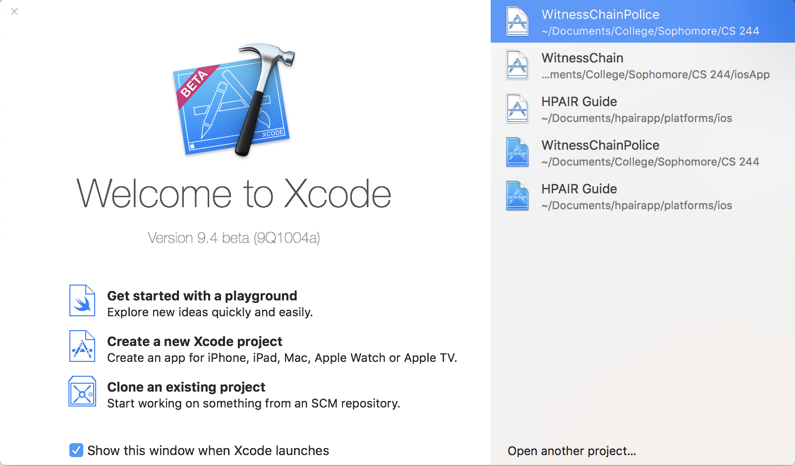
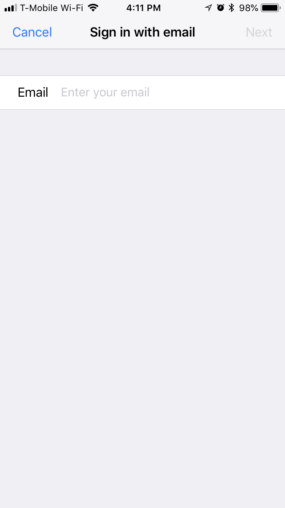
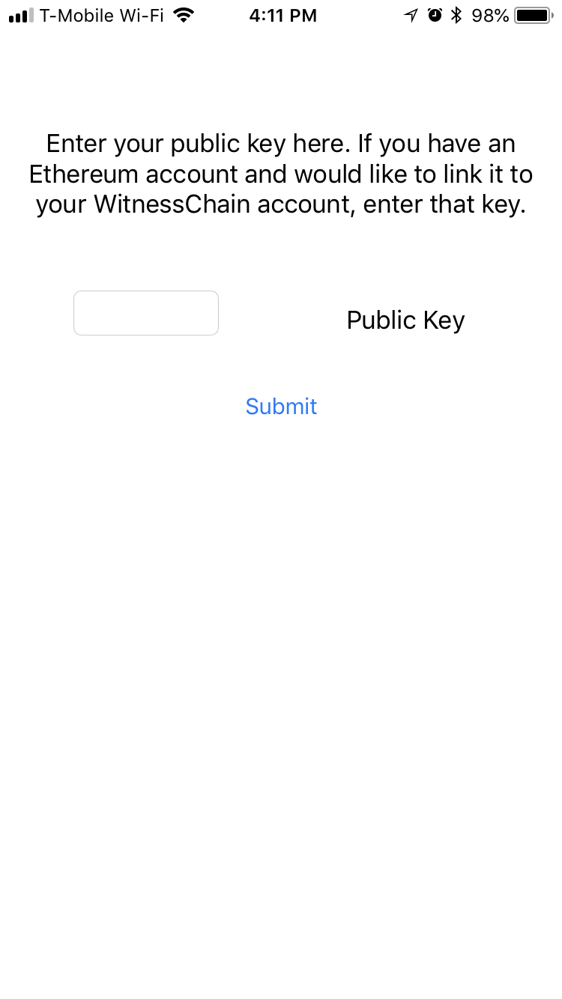
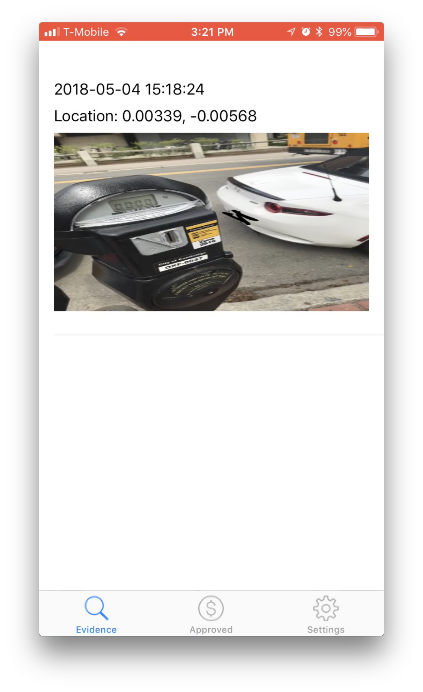
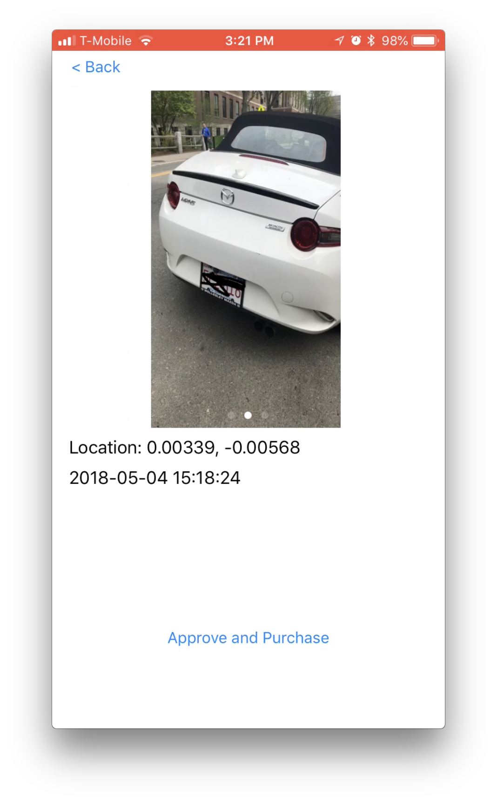

# WitnessChain Police

To watch our demo video, go to the following link: [Demo](https://www.youtube.com/watch?v=-Rm1n9U3wfQ).

## Quickstart

First off, make sure you've [set up the WitnessChain server](https://github.com/witnesschain/server) and have started running the server. It should look like this:


Now clone this repository by running:

```
git clone https://github.com/witnesschain/iosApp
```

Now open XCode on your Mac. Make sure you've accepted the license agreements. Open up your newly-cloned folder. The splash screen of XCode should look like this:



However, before installing our app on your phone, you will have to hardcode the address of the server in the app. Note the URL, which in this example is `http://10.252.147.83:3000`.

Then, navigate to the `appDelegate.swift` tab on the left, and look for a line that looks like this:

```
let baseUrl: String = "http://10.xxx.xxx.xx:xxxx"
```

You can just Command-F for `let baseURL`. Replace the placeholder string with the URL of the server, which again was `http://10.252.147.83:3000` in our example. Again, replace the string with the unique address that *your* server gave.

Then, plug in an iPhone to your computer, ensure that it is selected as the target device in the top left corner, and hit Play. The app should now be running on your phone!


## How to Use the App

The app begins with a login screen. Enter your credentials, and create an account if you do not already have one.



Then, link your account to your Ethereum public address. This will ensure your wallet is the same as your public one, if you already have one.



Now, you should have arrived at the evidence screen. Here, you can view evidence submitted to your police jurisdiction. As an officer, you may scroll through the evidence and select one that seems like a ticket could be valid.



On that page, you can see all of the blurred versions of the evidence as well as some location and time metadata. Should you choose to approve those pictures and purchase the evidence, you may tap the "Approve and Purchase" button, which will pay the submitter of the evidence.



From there, you can switch to the approved tab and view the purchased evidence files, gaining access to the "clear" versions of the images.
